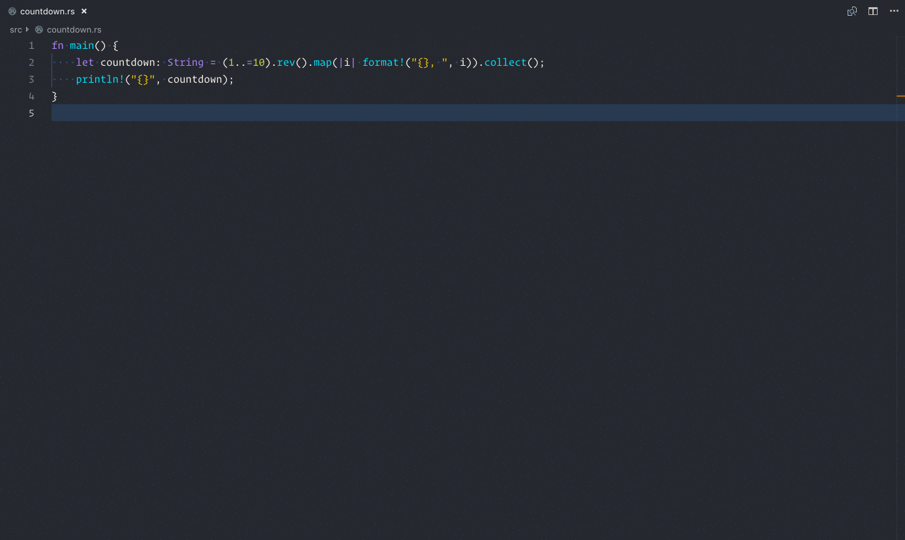

# cargo-inspect-vscode


[](http://opensource.org/licenses/MIT)

A Visual Studio Code extension for [cargo-inspect](https://github.com/mre/cargo-inspect/).

## Installation

Please first install [cargo-inspect](https://github.com/mre/cargo-inspect/):

```
cargo install cargo-inspect
```

Install this extension from the [VSCode
Marketplace](https://marketplace.visualstudio.com/items?itemName=cargo-inspect-vscode.cargo-inspect)

## Usage

1. Hit <kbd>⌘ Command</kbd> + <kbd>⇧ Shift</kbd> + <kbd>p</kbd>
2. Run `cargo-inspect: Run`.



## Contributing

This plugin is far from feature-complete.  
If you want to improve it, feel free to pick one of the [open issues](https://github.com/mre/cargo-inspect-vscode/issues) and give it a shot.  
In case you need any help, just add a comment to the issue to get a conversation started. :smiley:

## Credits

Magnifying glass designed by [Rawpixel.com]( https://www.freepik.com/free-vector/illustration-of-a-magnifying-glass_2945064.htm) 
